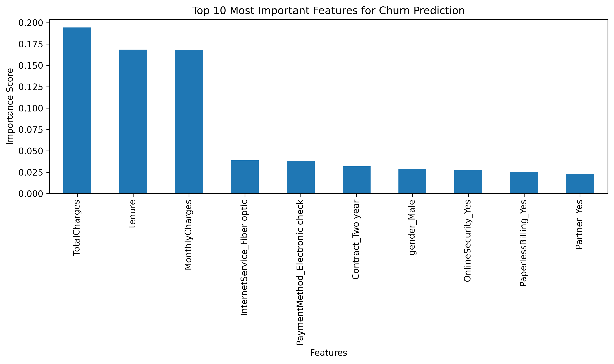
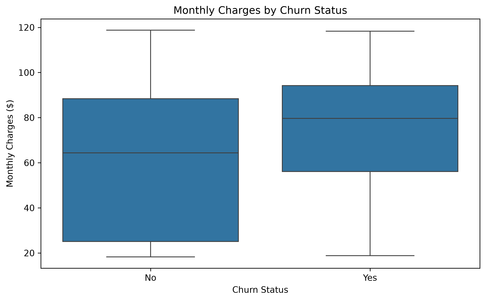
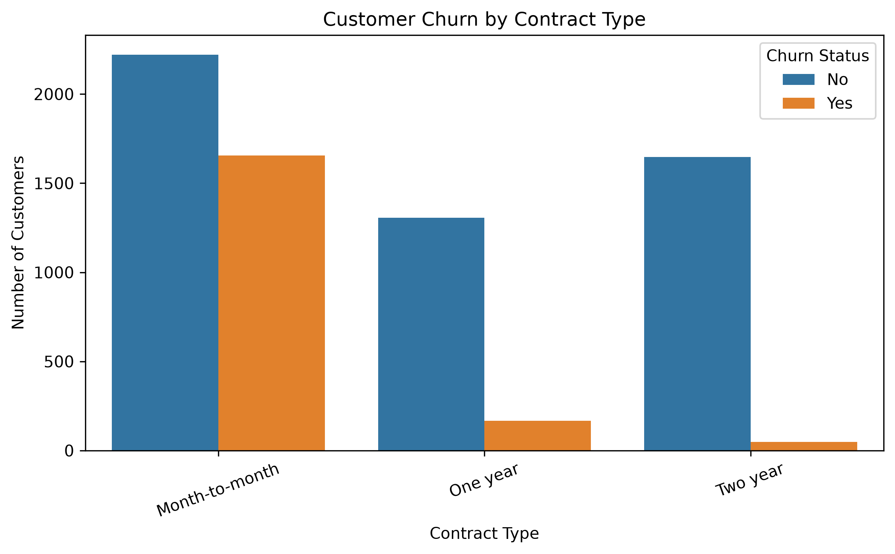
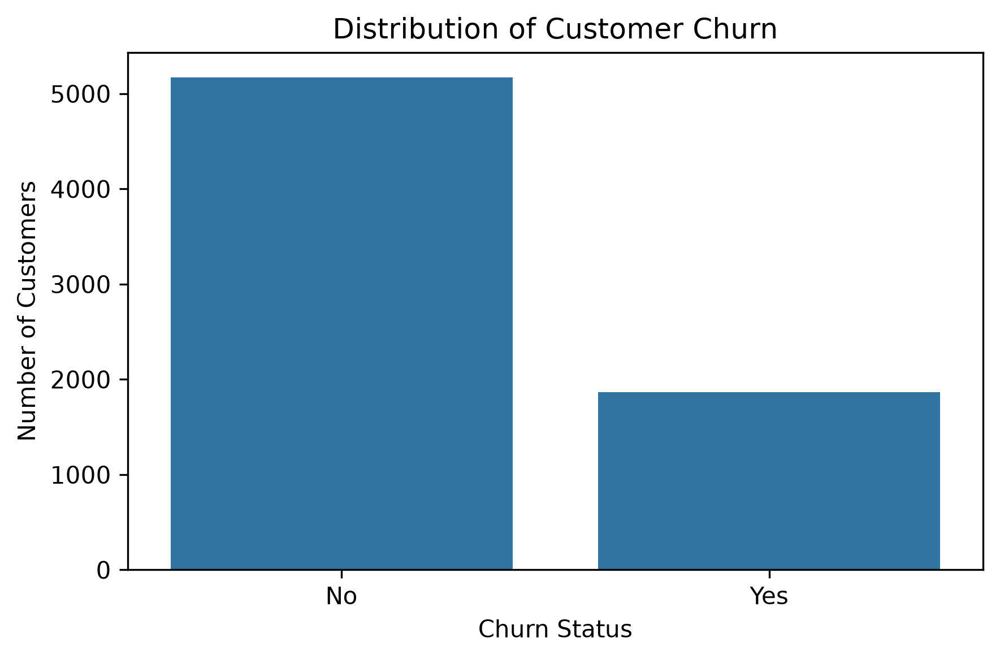
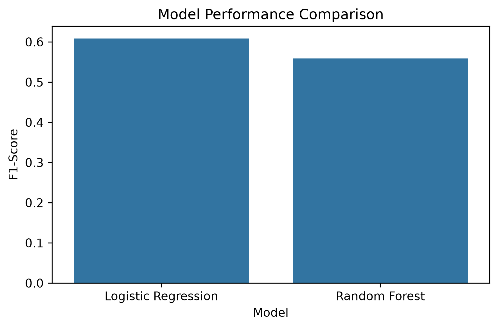
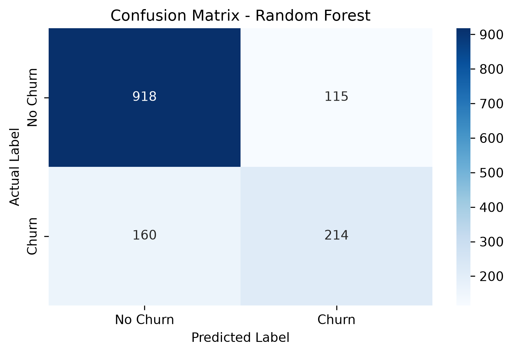

# 📉 Customer Churn Prediction


🌐 **Acesse a Aplicação Online:** [https://tc-churn-prediction.streamlit.app/](https://tc-churn-prediction.streamlit.app/)

## 📌 Objetivo
Prever o cancelamento (churn) de clientes de uma operadora de telecomunicações utilizando técnicas de Machine Learning. Identificar clientes com alta probabilidade de cancelamento permite que a empresa atue de forma proativa para retê-los.

## 📊 Dataset
O conjunto de dados utilizado é o **Telco Customer Churn Dataset**, disponível no Kaggle. Ele contém informações sobre o perfil do cliente, serviços contratados e se o cliente cancelou o serviço no último mês.

## 🛠️ Tecnologias e Modelos
- **Linguagem:** Python
- **Bibliotecas:** Pandas, NumPy, Scikit-Learn, Matplotlib, Seaborn
- **Modelos Utilizados:** Logistic Regression, Random Forest
- **Métricas de Avaliação:** Accuracy, Precision, Recall, F1-Score

## 📁 Estrutura do Projeto

```text
├── data/
│   ├── processed/         # Dados limpos e processados
│   └── raw/               # Dados originais (imutáveis)
├── models/                # Modelos treinados salvos (.joblib)
├── notebooks/             # Notebooks Jupyter para experimentação
│   ├── 01_eda.ipynb       # Análise Exploratória de Dados
│   ├── 02_preprocessing.ipynb # Limpeza e preparação dos dados
│   └── 03_modeling.ipynb  # Treinamento e avaliação de modelos
├── src/                   # Código fonte modularizado
│   ├── data_processing.py # Scripts para carregar e limpar dados
│   └── model.py           # Scripts para treinar e avaliar os modelos
├── reports/
│   └── figures/           # Gráficos gerados
├── app.py                 # Dashboard Streamlit de Previsão
├── train_final_model.py   # Script para treinar o modelo
├── README.md              # Este arquivo
└── requirements.txt       # Dependências do projeto
```

## 🚀 Como Executar

### 1. Clonar o Repositório e Configurar o Ambiente
Recomenda-se o uso de um ambiente virtual (`venv` ou `conda`).
```bash
# Crie e ative um ambiente virtual (exemplo com venv)
python -m venv venv
# No Windows:
venv\Scripts\activate
# No Linux/Mac:
source venv/bin/activate

# Instalar dependências
pip install -r requirements.txt
```

### 2. Uso da Aplicação

**Dashboard Interativo (Recomendado):**
Para rodar a interface visual e fazer simulações de previsão, execute:
```bash
streamlit run app.py
```
A aplicação abrirá automaticamente no seu navegador.

*Dicionário de Variáveis do Dashboard:*
- **Tempo como Cliente (Tenure):** Número de meses que a pessoa é cliente da empresa.
- **Mensalidade (Monthly Charges):** O valor mensal pago pelos serviços contratados.
- **Gastos Totais (Total Charges):** O valor histórico gasto (calculado automaticamente na interface).
- **Fatura Digital (Paperless Billing):** Se o cliente optou por receber a fatura exclusivamente via meio digital.
- **Segurança Online (Online Security):** Se o cliente contratou o pacote adicional de segurança oferecido pela operadora.

**Notebooks:**
Você também pode explorar as análises rodando os notebooks interativos:
```bash
jupyter notebook
```
Para treinar o modelo utilizando os scripts modularizados, importe os módulos da pasta `src/` no seu código principal.

## 💡 Principais Insights
Com base na análise exploratória inicial e na modelagem, extraímos os seguintes insights de negócio, que são embasados nas visualizações geradas pelos modelos:

### 1. Fatores de Maior Impacto (Feature Importance)
Os três fatores que mais influenciam a decisão de cancelamento (churn) são **Total Charges**, **Tenure** (tempo de permanência) e **Monthly Charges**. Isso indica que o peso financeiro e o histórico de fidelidade do cliente são os pilares da retenção. Outros serviços, como *Fiber optic* e métodos de pagamento *Electronic check*, também aparecem como indicadores secundários relevantes.



### 2. O Perfil Financeiro do Churn
A análise revelou que os clientes que cancelaram o serviço tendem a ter **mensalidades mais altas** (mediana em torno de $80) em comparação com os clientes que permaneceram (mediana próxima a $65). Mensalidades pesadas sem a devida percepção de valor podem estar impulsionando a saída.



### 3. A Fragilidade do Contrato "Month-to-Month"
Existe uma disparidade clara no cancelamento com base no tipo de contrato. A esmagadora maioria dos clientes que deram *churn* possuía contratos **"Month-to-month"** (mês a mês). Em contrapartida, clientes com contratos anuais (One year / Two year) apresentam taxas de cancelamento residuais. Isso sugere que oferecer incentivos para a transição para contratos de longo prazo é uma excelente estratégia de retenção.



### 4. Avaliação dos Modelos de Previsão
O dataset apresenta um desbalanceamento considerável (~73% de retenção vs ~27% de churn).



Ao testar diferentes algoritmos, a **Regressão Logística** superou a Random Forest na métrica de F1-Score (~0.61 contra ~0.56), demonstrando ser uma opção mais robusta e equilibrada para lidar com a relação precisão/recall deste problema. A matriz de confusão e o comparativo abaixo ajudam a visualizar esse desempenho.



